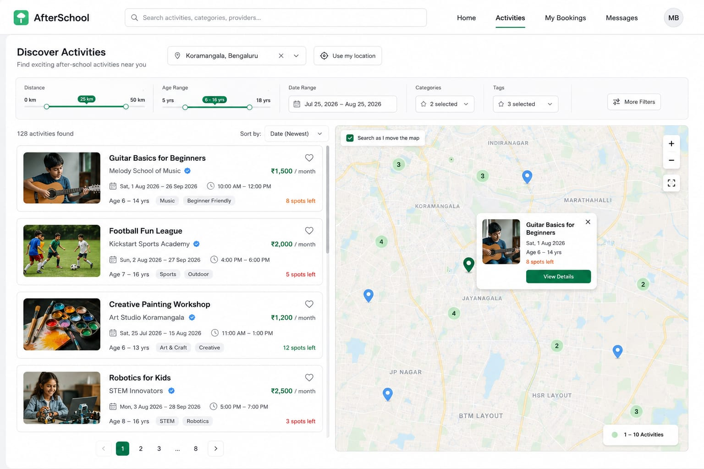

# AfterSchool – Discover Activities

A desktop web interface for discovering and exploring after-school activities for children.

## Preview



## About the Project

AfterSchool is a web interface designed to help parents discover suitable after-school activities for their children based on location, age range, dates, categories, and tags.

The interface focuses on making activity discovery simple, organized, and easy to explore.

## Features

- Activity discovery and browsing
- Location-based activity search
- Distance filter
- Age range filter
- Date range selection
- Category and tag filters
- Activity cards with pricing and availability
- Interactive map interface
- Activity location markers
- Activity details popup
- Pagination

## Design

The interface was designed with a clean, modern layout and a focus on:

- Clear visual hierarchy
- Easy scanning of activity information
- Simple filtering
- Consistent spacing and typography
- Accessible interface elements

## Technologies Used

- HTML
- CSS
- JavaScript
- Figma

## Project Structure

```text
AfterSchool/
│
├── images/
│   ├── football.jpg
│   ├── guitar.jpg
│   ├── map-background.jpg
│   ├── painting.jpg
│   ├── project-preview.jpg
│   └── robotics.jpg
│
├── index.html
├── style.css
├── script.js
└── README.md